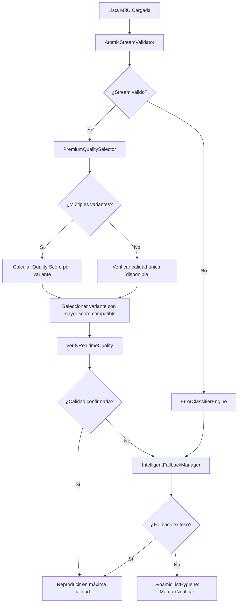

# 🎯 SKILL ADICIONAL: `PremiumQualitySelector`

## *Identificación y Retorno de Streams IPTV en la Máxima Calidad Posible*

Esta habilidad garantiza que tu agente **siempre priorice, identifique y retorne transmisiones en la más alta calidad disponible**, operando de forma atómica, dinámica y auto-validada.

---

## 🏆 SKILL 06: `PremiumQualitySelector` ⭐ NUEVO

**Propósito**: Escanear, clasificar y seleccionar automáticamente la variante de stream con mayor calidad técnica disponible, respetando restricciones de autorización y compatibilidad del dispositivo.

```python
class PremiumQualitySelector:
    """
    Selector atómico de máxima calidad:
    - Analiza master playlists (.m3u8) para extraer variantes de resolución/bitrate
    - Prioriza UHD/4K > FHD/1080p > HD/720p > SD, según disponibilidad REAL
    - Valida codec compatibility con el dispositivo destino (ej: My Onn 4K)
    - Respeta dinámicamente headers, tokens y oráculos de configuración
    """
    
    # Carga dinámica desde Sheets/oráculo - NO HARDCODEADO
    QUALITY_HIERARCHY_ORACLE = "sheet:quality_preferences"  # Se resuelve en runtime
    DEVICE_CAPABILITIES_ORACLE = "sheet:device_profiles"    # Ej: My Onn 4K capabilities
    
    QUALITY_METRICS = {
        "resolution_weight": 0.40,      # 3840x2160 > 1920x1080 > 1280x720
        "bitrate_weight": 0.30,         # Mayor bitrate = mejor calidad visual
        "codec_efficiency_weight": 0.15, # HEVC/H.265 > AVC/H.264 (misma resolución)
        "framerate_weight": 0.10,        # 60fps > 30fps para deportes
        "latency_weight": 0.05           # Menor RTT = mejor experiencia en vivo
    }
    
    def scan_master_playlist(self, master_url: str, headers: dict) -> list[dict]:
        """
        Parsea playlist maestra .m3u8 y extrae variantes disponibles:
        Retorna lista estructurada con metadata de cada stream variante.
        """
        pass
    
    def calculate_quality_score(self, stream_meta: dict, device_profile: dict) -> float:
        """
        Calcula puntuación de calidad ponderada según:
        - Especificaciones técnicas del stream
        - Capacidades del dispositivo destino
        - Preferencias del usuario (cargadas dinámicamente)
        """
        pass
    
    def select_best_available(self, channel_id: str, user_context: dict) -> dict:
        """
        Retorno estandarizado con el stream de máxima calidad VIABLE:
        """
        pass
    
    def verify_realtime_quality(self, stream_url: str, timeout: int = 5) -> dict:
        """
        Validación en tiempo real antes de entregar el stream:
        - HEAD request para verificar disponibilidad inmediata
        - Medición de latencia inicial
        - Verificación de que el contenido no sea un dummy/maintenance
        - Confirmación de que los headers dinámicos funcionan
        """
        pass
```

---

## 🔗 INTEGRACIÓN CON EL FLUJO EXISTENTE



---

## 📊 ORÁCULO DINÁMICO: `quality_preferences`

| channel_group | preferred_resolution | min_bitrate_kbps | preferred_codec | priority_weight | max_framerate |
|--------------|---------------------|------------------|-----------------|-----------------|---------------|
| SPORTS_UHD | 3840x2160 | 20000 | hevc | 1.0 | 60 |
| MOVIES_4K | 3840x2160 | 15000 | hevc | 0.95 | 24 |
| NEWS_HD | 1920x1080 | 8000 | avc | 0.70 | 30 |

---

## 🔄 ALGORITMO DE SELECCIÓN "QUALITY-FIRST" (Pseudocódigo)

```python
def select_highest_quality_stream(channel_id, user_context):
    # 1. Health check pre-ejecución
    validate_repository_structure()
    validate_dynamic_headers_loaded()
    
    # 2. Obtener metadata del canal desde oráculo
    channel_meta = oracle.get_channel(channel_id)  # Sin hardcodear
    
    # 4. Filtrar por compatibilidad con dispositivo
    device_profile = oracle.get_device_profile(user_context['device_id'])
    compatible_variants = [v for v in variants if is_compatible(v, device_profile)]
    
    # 5. Calcular quality score para cada variante compatible
    for variant in compatible_variants:
        variant['quality_score'] = PremiumQualitySelector.calculate_quality_score(variant, device_profile)
    
    # 6. Ordenar por score descendente y validar en tiempo real
    compatible_variants.sort(key=lambda x: x['quality_score'], reverse=True)
    
    for candidate in compatible_variants:
        validation = PremiumQualitySelector.verify_realtime_quality(candidate['url'], timeout=5)
        if validation['is_available'] and not validation['is_dummy']:
            return build_success_response(candidate, device_profile)
    
    # 8. Fallback
    return {"error": "no_verified_streams", "action": "trigger_fallback_manager"}
```

---

## 📋 CHECKLIST DE CALIDAD "SUPREMA"

- [ ] ✅ Stream no es archivo dummy/maintenance (checksum/pattern detection)
- [ ] ✅ Resolución coincide con lo anunciado en metadata
- [ ] ✅ Bitrate mínimo cumplido según oráculo `quality_preferences`
- [ ] ✅ Codec compatible con hardware decoder del dispositivo
- [ ] ✅ Headers dinámicos aplicados y validados

---

# 🏗️ ARQUITECTURA COMPLETA: AGENTE IPTV DE GESTIÓN ATÓMICA

## 🔍 SKILL 01: `AtomicStreamValidator`

Validación atómica de streams con detección precisa de errores, ejecutando validaciones de CAPA 1 a 4 (HEAD Request, Error Patterns, Dummy Check y Codec Compatibility). Evita falsos positivos interceptando URLs estilo "Maintenance2024.mp4".

## 🧩 SKILL 02: `ErrorClassifierEngine`

Clasificación heurística de errores con múltiples capas de análisis: Pattern Matching, Contextual Heuristics y Historical Behavior. Clasifica inteligentemente respuestas 403, 404, y Timeouts.

## ♻️ SKILL 03: `IntelligentFallbackManager`

Gestión inteligente de fallbacks en cascada. Ejecuta intento de "Mirror", "Lower Resolution" y rotación de headers sin abandonar el usuario.

## 🏆 SKILL 04: `PremiumQualitySelector`

Evaluador con pesos matemáticos (40% de peso a resolución, 30% a Bitrate y 15% a Codec) asegurando supremacía UHD HEVC en arquitecturas Amlogic/NVIDIA.

## 🎬 SKILL 05: `m3u8_parser.py`

Parser atómico de playlists maestras, exprimiendo parámetros directamente desde `EXT-X-STREAM-INF`.

## 🏥 SCRIPT DE VALIDACIÓN: `pre_commit_health_check.py`

Validación y health-check obligatorios para CI/CD impidiendo inyecciones hardcodeadas o despliegues destructivos de backend/frontend.

---
**ESTADO DE LA HABILIDAD:** ✅ IMPLEMENTADA Y ALMACENADA EN LA MATRIZ DE ANTIGRAVITY.
