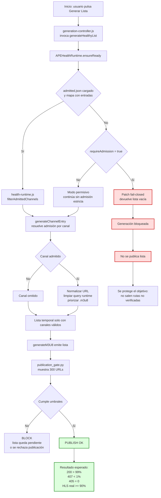

# APE Health Admission — Diagrama de flujo con fail-closed

## Filosofía de diseño

> **Preferir no publicar antes que publicar una lista que parezca completa pero reproduzca peor.**

La lista final **no debe construirse desde el catálogo crudo del panel IPTV**. Debe construirse desde un **conjunto de rutas admitidas, verificadas y normalizadas**.

## Cadena única de protección

```
health_checker.py → admitted.json → health-runtime.js (fail-closed) → publication_gate.py
      ↓                  ↓                      ↓                           ↓
 genera verdad     persiste verdad      aplica verdad             verifica verdad
```

Cada eslabón protege al siguiente. El fail-closed es el candado que impide que un fallo silencioso en el eslabón N contamine los eslabones N+1, N+2.

## Diagrama de flujo completo



- **Nodos rojos** (H, I, J): trampa fail-closed. Si el mapa de admisión está vacío con `requireAdmission=true`, la publicación se bloquea.
- **Nodos verdes** (U, V): objetivo operativo final.
- Entre ellos hay **7 puntos de filtrado independientes** que garantizan que solo rutas verificadas lleguen a publicación.

## Por qué el patch fail-closed es el candado

| Elemento | Sin fail-closed | Con fail-closed |
|---|---|---|
| `admitted.json` vacío o fallido | Se publican canales no verificados | Se bloquea la publicación |
| Control sobre `200 > 99%` | Se pierde silenciosamente | Se preserva |
| Control sobre `407 < 1%` | Se degrada — vuelven rutas problemáticas | Se mantiene — solo pasan rutas admitidas |
| Coherencia del gate de publicación | Débil — puede ser bypass'd | Fuerte — bloqueo arriba del gate |
| Observabilidad de fallos | Oculta — silencio = "todo bien" | Explícita — lista vacía = hay que mirar |

## Código del patch aplicado

```javascript
filterAdmittedChannels(channels) {
    if (!this.config.requireAdmission) return channels;
    if (this.admittedMap.size === 0) {
        if (this.config.debug) console.warn('🚫 [APE-HEALTH] admittedMap empty with requireAdmission=true -> returning empty list (fail-closed)');
        return [];
    }
    return (channels || []).filter(channel => {
        const id = String(channel && (channel.stream_id || channel.id || channel.num || '') || '').trim();
        if (!id) return false;
        return this.admittedMap.has(`id:${id}`);
    });
}
```

Archivo: `frontend/js/ape-v9/health-runtime.js` (líneas 165-175)
