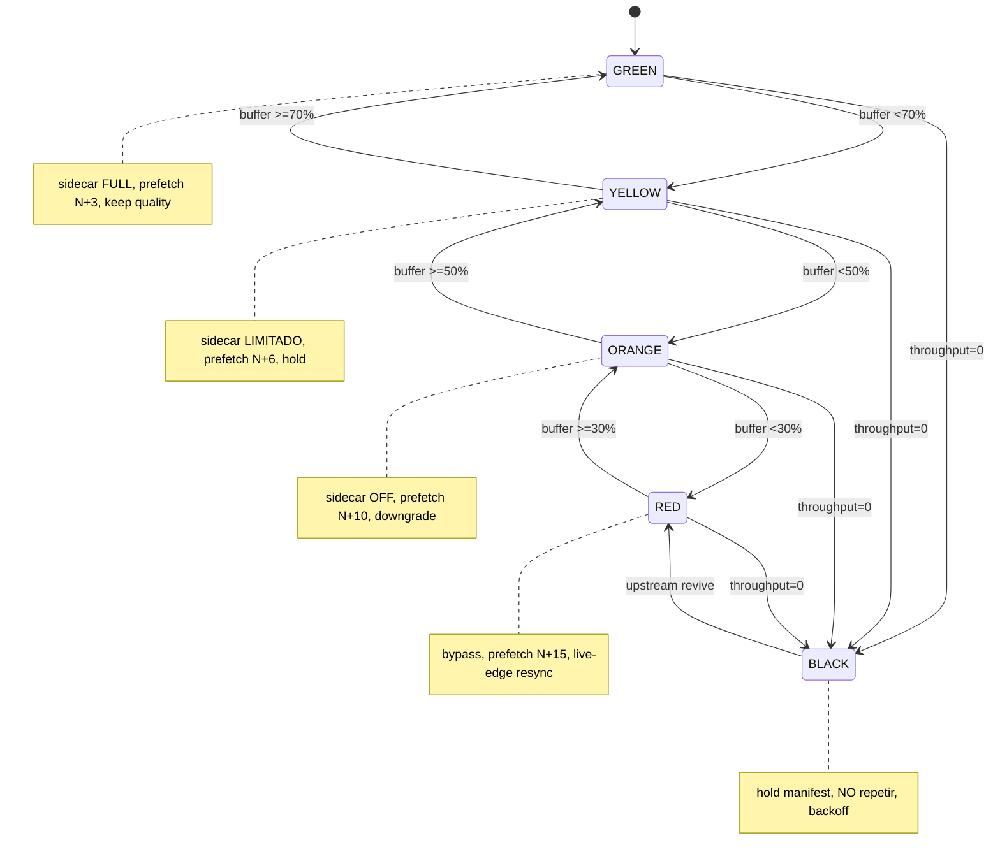

# APE Buffer Governor v2.0 — Runbook Operativo

> **Regla madre:** BUFFER BAJO NO SE RESUELVE REPITIENDO VIDEO VIEJO.
> **Jerarquía:** `continuidad > segmento fresco > buffer>50% > calidad > procesamiento pesado`.

Servicio Rust (axum) que clasifica el estado del buffer por canal y decide la acción
bajo esa jerarquía. Es un **plano de control loopback**: NO proxia video, NO frena,
NO modifica el stream. Solo MIDE (vía 6 Lua snipers en el shield) y DECIDE; nginx y el
motor Crystal siguen sirviendo los bytes.

| Pieza | Ubicación | Puerto / Path |
|---|---|---|
| Binario Rust (Governor) | `vps/buffer-governor/rust/` (`lib.rs` contrato + `main.rs` monolito) | **`127.0.0.1:8090`** |
| nginx control server | `vps/buffer-governor/nginx/buffer_governor.conf` | **`127.0.0.1:8091`** (loopback-only) |
| systemd unit | `vps/buffer-governor/systemd/ape-buffer-governor.service` | User `ape-auditor`, no-root |
| 6 Lua snipers | `vps/buffer-governor/lua/` | enganchados DESDE el shield-location.conf |

> ⚠️ **NUNCA `:8084`.** Ese puerto es `ape-crystal-rust` — el **baseline dorado vivo**,
> CONGELADO E INTACTO. El Governor es un servicio SEPARADO en `:8090`.

---

## ⚠️ Estado de madurez: F0 build-only (verdad honesta)

| Fase | Qué cubre | Estado hoy |
|---|---|---|
| **F0 (local)** | `cargo check` / `test` / `clippy` VERDE (4/4 tests) — build-only en Windows | ✅ **COMPLETO** |
| **F1+ (VPS)** | `nginx -t` real, `pytest` E2E, arranque del binario, despliegue a prod | ⏳ **PENDIENTE — requiere Linux/VPS** |

**Por qué F1 no se puede correr en local:** Windows App Control bloquea ejecutar el binario
nativo compilado, y `nginx -t` + el E2E pytest necesitan el entorno OpenResty/Linux del VPS.
El pipeline de deploy (`tools/cicd/deploy_buffer_governor.sh`, 15 gates) **termina en gate 8
en F0** y exige `CONFIRM=yes` para los gates F1+. **Nada va a prod sin OK explícito.**

Este runbook documenta el flujo operativo **objetivo (VPS)**; los comandos marcados
`[F1/VPS]` solo aplican una vez desplegado en Linux.

---

## 1. Arrancar / parar el servicio

### Bajo systemd (entorno VPS) `[F1/VPS]`

```bash
# Instalar la unit (una sola vez)
sudo cp vps/buffer-governor/systemd/ape-buffer-governor.service /etc/systemd/system/
sudo systemctl daemon-reload

# Arrancar / habilitar al boot
sudo systemctl start  ape-buffer-governor
sudo systemctl enable ape-buffer-governor

# Parar / reiniciar
sudo systemctl stop    ape-buffer-governor
sudo systemctl restart ape-buffer-governor

# Estado + últimas líneas
systemctl status ape-buffer-governor --no-pager
```

Caps LOAD-BEARING de la unit (protegen nginx + Crystal — el Governor JAMÁS los ahoga):
`User=ape-auditor` (no-root) · `CPUQuota=120%` · `CPUWeight=30` · `Nice=10` ·
`MemoryMax=256M` · `OOMScoreAdjust=600` (se mata ANTES que nginx/Crystal bajo presión) ·
`Restart=on-failure` `RestartSec=5s` · `TasksMax=64` · hardening
(`NoNewPrivileges`, `ProtectSystem=strict`, `PrivateTmp`).

### Arranque manual / debug `[F1/VPS]`

```bash
cd vps/buffer-governor/rust
cargo build --release
BG_BIND=127.0.0.1:8090 RUST_LOG=ape_buffer_governor=info ./target/release/ape-buffer-governor
# Bind esperado en el log: "APE Buffer Governor v2.0 on :8090"
```

### Verificación F0 (local, Windows) — lo que SÍ se puede correr hoy

```bash
cd vps/buffer-governor/rust
cargo check      # debe quedar VERDE
cargo test       # 4/4 tests VERDE
cargo clippy     # VERDE
```

---

## 2. Verificar `/health`, `/metrics`, `/buffer/state`

Dos puntos de entrada (mismos endpoints):
- **Directo al Rust:** `127.0.0.1:8090` (lo que el binario expone).
- **Vía nginx control:** `127.0.0.1:8091` (loopback-only; `allow 127.0.0.0/8; deny all`).

### `/health` (GET)

```bash
curl -s http://127.0.0.1:8090/health | jq .
```
```json
{ "service": "ape-buffer-governor", "version": "2.0.0", "port": 8090, "uptime_ms": 12345 }
```
Vivo = HTTP 200 + JSON con `service: "ape-buffer-governor"`. Cualquier otra cosa = caído.

### `/metrics` (GET) — contadores agregados

```bash
curl -s http://127.0.0.1:8090/metrics | jq .
```
| Campo | Significado | Qué vigilar |
|---|---|---|
| `requests` | requests totales atendidos | crece = el plano recibe tráfico |
| `uptime_ms` | uptime del proceso | reset a ~0 = reinició (mirar logs) |
| `decisions` | decisiones FSM tomadas | 0 con tráfico = Lua no reporta |
| `prefetch_queue_depth` | tareas frescas en cola | crece sin drenar = planner atascado |
| `prefetch_enqueued_total` | encolados acumulados | — |
| `ledger_blocks` | repeticiones bloqueadas (no-repeat) | **subidas bruscas = upstream repitiendo** |
| `qoe_events` | eventos QoE ingeridos | — |
| `sidecar_in_flight` | slots de upscaling activos | >0 solo válido en GREEN/YELLOW |
| `cache_index_len` | URIs indexadas (fresh/stale) | — |

### `/buffer/state` (POST) — clasifica un reporte y devuelve la decisión

`/buffer/state` y `/buffer/report` son el **mismo handler**. Recibe un `BufferReport`,
devuelve un `BufferDecision`.

```bash
curl -s -X POST http://127.0.0.1:8090/buffer/state \
  -H 'Content-Type: application/json' \
  -d '{"channel_id":"ch_test","buffer_s":20,"capacity_s":30,
       "throughput_bps":12000000,"variant_bps":8000000}' | jq .
```
```json
{
  "channel_id": "ch_test",
  "state": "GREEN",
  "action": "keep_quality",
  "sidecar_enabled": true,
  "prefetch_depth": 3,
  "upstream_throughput_bps": 12000000,
  "headroom": 1.5,
  "trend": "stable",
  "buffer_percent": 66.6,
  "decided_at_ms": 1700000000000
}
```

`buffer_percent = buffer_s / capacity_s * 100`. `headroom = throughput_bps / variant_bps`
(`<1.0` = la variante no cabe en el ancho de banda real). `upstream_alive = throughput_bps > 0`
(throughput 0 ⇒ **BLACK**, gane lo que gane el porcentaje).

Otros endpoints de control (todos en `:8090` / `:8091`):
`POST /prefetch/enqueue` · `POST /prefetch/plan` · `GET /prefetch/status` ·
`POST /segment/fetch` (= `/segment/probe`) · `POST /live-edge/probe` · `POST /qoe/event`.

---

## 3. Leer los estados (FSM) y qué hacer en cada uno

Clasificación: `BufferState::classify(buffer_percent, upstream_alive)`.



| Estado | Umbral | sidecar | prefetch | Acción típica | Qué significa operativamente |
|---|---|---|---|---|---|
| **GREEN** | buffer ≥70% | ON (full) | N+3 | `keep_quality` (o `prefetch_more` si headroom <1.2) | Salud plena. Calidad máxima sostenible. |
| **YELLOW** | 50–70% | LIMITADO (½ presupuesto) | N+6 | `hold_manifest` (o `prefetch_more` si degradando) | Atención. Filtros ligeros; prefetch más agresivo. |
| **ORANGE** | 30–50% | OFF | N+10 | `disable_sidecar` (o `downgrade_variant` si headroom <1.0) | Procesamiento pesado se apaga; baja calidad si la variante no cabe. |
| **RED** | <30% | OFF | N+15 | `downgrade_variant` + live-edge resync | Crítico. Bypass, prefetch máximo hacia el borde vivo. |
| **BLACK** | throughput=0 | OFF | 0 | `black_backoff` | **Upstream muerto.** Mantener manifest, NO repetir, backoff. |

**Override de tendencia (frescura > buffer cómodo):** si `trend = Collapsing` y NO es BLACK,
la acción es **`live_edge_resync`** aunque el buffer esté lleno (test
`green_with_collapsing_trend_resyncs_to_fresh_not_repeat`). Nunca se repite video viejo
para "rellenar" un buffer que parece cómodo pero cuyo throughput se desploma.

### Qué hacer en cada estado (operador)

- **GREEN** — no acción. Es el objetivo. Si `sidecar_in_flight` está pegado al máximo y hay
  glitches, revisar presupuesto sidecar (8 slots por defecto).
- **YELLOW** — no acción inmediata; es transitorio sano. Si se queda fijo en YELLOW por
  canal, mirar `headroom` del canal (variante demasiado alta para la red real).
- **ORANGE** — el sistema YA apagó sidecar y/o bajó variante. Verificar que NO sea por un
  bug de bitrate declarado (fake-4K sobre red insuficiente). Acción real solo si es masivo.
- **RED** — síntoma de red/upstream degradado. Cruzar con `ledger_blocks` (¿el upstream está
  repitiendo?) y con `/live-edge/probe` (¿hay gap?). El Governor ya está en bypass + resync.
- **BLACK** — upstream caído. Confirmar con `curl` directo al proveedor (NO desde local, ver
  troubleshooting). El Governor mantiene el manifest y hace backoff; **no** intenta tapar el
  403/timeout repitiendo segmentos. Si es masivo en muchos canales → incidente de upstream/red.

---

## 4. Comandos de diagnóstico

```bash
# Salud + métricas en una línea
curl -s http://127.0.0.1:8090/health  | jq -c .
curl -s http://127.0.0.1:8090/metrics | jq -c .

# Clasificar un escenario a mano (forzar cada estado)
forced() { curl -s -X POST http://127.0.0.1:8090/buffer/state -H 'Content-Type: application/json' -d "$1" | jq -c '{state,action,sidecar_enabled,prefetch_depth,trend}'; }
forced '{"channel_id":"c","buffer_s":25,"capacity_s":30,"throughput_bps":12000000,"variant_bps":8000000}'  # GREEN
forced '{"channel_id":"c","buffer_s":18,"capacity_s":30,"throughput_bps":9000000,"variant_bps":8000000}'   # YELLOW
forced '{"channel_id":"c","buffer_s":12,"capacity_s":30,"throughput_bps":6000000,"variant_bps":8000000}'   # ORANGE (headroom<1 → downgrade)
forced '{"channel_id":"c","buffer_s":5,"capacity_s":30,"throughput_bps":2000000,"variant_bps":8000000}'    # RED
forced '{"channel_id":"c","buffer_s":20,"capacity_s":30,"throughput_bps":0,"variant_bps":8000000}'         # BLACK

# Probe de borde vivo (¿gap? ¿resync?)
curl -s -X POST http://127.0.0.1:8090/live-edge/probe -H 'Content-Type: application/json' \
  -d '{"manifest_uri":"https://prov/ch.m3u8","highest_media_sequence":1050}' | jq .

# Clasificación de un segmento (el 403 se CLASIFICA, no se oculta)
curl -s -X POST http://127.0.0.1:8090/segment/fetch -H 'Content-Type: application/json' \
  -d '{"segment_uri":"https://prov/seg1.ts"}' | jq '{status,fresh,error_class}'

# Estado del puerto / proceso  [F1/VPS]
ss -ltnp | grep -E ':809[01]'            # :8090 (Rust) + :8091 (nginx control)
systemctl status ape-buffer-governor --no-pager

# Logs en vivo  [F1/VPS]
journalctl -u ape-buffer-governor -f
journalctl -u ape-buffer-governor --since '10 min ago' --no-pager

# Validar nginx tras tocar el conf  [F1/VPS]
sudo nginx -t && sudo systemctl reload nginx
```

`error_class` posibles: `auth_token_problem` (401), `provider_block` (403/429),
`temporary_upstream` (5xx/timeout/conn fail). `null` = 2xx fresco.

---

## 5. Troubleshooting

| Síntoma | Causa probable | Acción |
|---|---|---|
| `/health` no responde | binario caído / no arrancó / puerto ocupado | `systemctl status`; `journalctl -u ...`; `ss -ltnp \| grep :8090`. Si `:8090` lo tiene otro proceso → conflicto, NO matar `:8084`. |
| `/health` OK pero `decisions=0` con tráfico | los Lua snipers no reportan a `:8090` | confirmar que `buffer_governor.conf` está incluido y que los `require(...)` están enganchados en el shield-location.conf; `lua_code_cache on`. |
| `503`/`502` desde `:8091` | el upstream Rust (`:8090`) está down (`max_fails=3 fail_timeout=10s`) | arrancar/levantar el binario; el control nginx no inventa respuestas. |
| `ledger_blocks` sube en picos | upstream sirviendo segmentos repetidos / media_seq regresivo | esperado y correcto: el guard ESTÁ protegiendo. Si es masivo, el upstream del canal está degradado. |
| Muchos canales en **BLACK** | upstream/proveedor caído o red del VPS rota | `curl` al proveedor **desde el VPS** (no desde local — ver nota). NO es bug del Governor. |
| `sidecar_in_flight` >0 en ORANGE/RED | no debería ocurrir (sidecar OFF) | bug de invariante; capturar `/metrics` + reporte y revisar `try_acquire`. |
| `nginx -t` falla tras editar conf `[F1/VPS]` | typo / shared dict duplicado / colisión de server block | revertir al backup; nunca reemplazar el server block del shield. |
| Binario no ejecuta en Windows local | App Control (esperado en F0) | normal: arranque/E2E son gate **F1/VPS**. Usar `cargo test` para validar la lógica. |

### Notas honestas de diagnóstico

- **No declares un upstream "muerto" desde un smoke test local.** El test desde Windows
  **nunca** alcanza el proveedor real. Un BLACK/timeout local NO prueba caída del proveedor;
  confirma siempre **desde el VPS**.
- **El 403 nunca se oculta como 200 ciego e infinito.** Se clasifica (`provider_block` /
  `auth_token_problem`) y el no-repeat guard decide HOLD/RESYNC. Si ves "200 OK eterno" sobre
  un 403, es un bug — captura y reporta.
- **No matar `:8084` jamás.** Si crees que hay conflicto de puerto, verifica primero qué
  proceso es; el baseline dorado Crystal está congelado e intacto.

---

## 6. Invariantes (no romper al operar)

15 invariantes vigentes — los críticos para el operador:

1. **No repetir** `media_sequence` / `uri` / `hash` / `PDT` en vivo (no-repeat ledger).
2. No mapear `N+1 → bytes de N` (no servir el segmento equivocado).
3. No TS en blanco como "normal".
4. **No 403 infinito** silencioso — siempre clasificado.
5. No upscaling (sidecar) con buffer bajo — sidecar OFF en ORANGE/RED/BLACK.
6. **No bloquear nunca el playback** — los Lua snipers JAMÁS llaman `ngx.exit` (verificado:
   cero `ngx.exit` en los 6 Lua); todo va en `pcall` → passthrough silencioso si algo falla.
7. Siempre original fresco si el enhanced no está listo.
8. **Siempre continuidad > calidad.**
9. Fallback siempre a HLS válido.

> Anti-403 de 4 capas + `proxy_cache_use_stale` SOLO misma URI (jamás stale como futuro).
> El Governor es plano de control: **observa y decide; nunca toca los bytes del video.**
