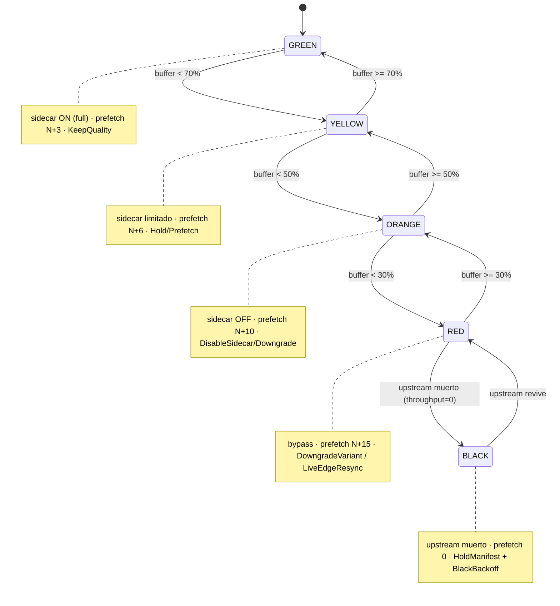

# APE Buffer Governor v2.0 — Implementación Suprema

> **Estado:** F0 build-only local. Crate Rust compila (`cargo check/test/clippy` VERDE, 4/4 tests),
> 6 módulos Lua sin `ngx.exit`, conf nginx corregido, systemd unit y CI/CD de 15 gates listos.
> **Nada desplegado a producción.** El baseline dorado (`ape-crystal-rust`, `:8084`, `/shield/`) queda
> **CONGELADO E INTACTO**. El Governor es un servicio **separado** en `:8090` que coexiste, no reemplaza.
>
> **Ubicación:** `vps/buffer-governor/`

---

## 1. Qué problema resuelve

El stack actual nunca frena el video (autopista) pero tampoco tiene un cerebro que decida **qué hacer
cuando el buffer baja**. La tentación clásica — y prohibida — es "rellenar" el buffer repitiendo
segmentos viejos del caché. Eso produce micro-loops de imagen y rompe el live-edge.

**Regla madre (no negociable):**

```
BUFFER BAJO NO SE RESUELVE REPITIENDO VIDEO VIEJO.
```

**Jerarquía de continuidad (orden de prioridad de las acciones):**

```
continuidad  >  segmento fresco  >  buffer>50%  >  calidad  >  procesamiento pesado
```

El Governor observa telemetría de buffer/throughput por canal, la clasifica en una FSM de 5 estados,
y emite una **acción** que siempre respeta esa jerarquía: prefiere bajar calidad o resincronizar al
borde vivo antes que servir un frame repetido.

---

## 2. Arquitectura

El sistema tiene **dos planos** que se hablan por loopback, sin tocar el camino del video:

- **Plano de datos (video):** sigue siendo **100% el `/shield/` existente** (`shield-location.conf` →
  `ape-crystal-rust` en `:8084`). Bytes verbatim del proveedor, SHIELDED intacto, passthrough puro.
- **Plano de control (decisión):** el **Buffer Governor Rust en `:8090`** + los **6 snipers Lua** que
  corren *dentro de los wrappers Lua ya enganchados al shield*. Los Lua sólo **miden y reportan**; el
  Rust **decide**; el resultado vuelve como hint, nunca como bloqueo.

```mermaid
flowchart LR
    subgraph PLAYER["Player / ARA / nginx"]
        P["telemetría buffer\n(buffer_s, throughput_bps, variant_bps)"]
    end

    subgraph SHIELD["/shield/ EXISTENTE  (plano de datos — INTACTO)"]
        SL["shield-location.conf"]
        CR["ape-crystal-rust :8084\n(baseline dorado, passthrough)"]
        SL --> CR
    end

    subgraph LUA["6 snipers Lua  (dentro de los wrappers del shield)"]
        L1["ape_buffer_sniper\n(rewrite + log: mide/reporta)"]
        L2["ape_prefetch_planner\n(rewrite)"]
        L3["ape_no_repeat_guard\n(body_filter)"]
        L4["ape_variant_escape\n(body_filter: master only)"]
        L5["ape_live_edge_resync\n(RED/BLACK)"]
        L6["ape_segment_pattern_learner"]
    end

    subgraph RUST["Buffer Governor :8090  (plano de control — Rust)"]
        G["12 managers + AppState\nFSM + EWMA + ledger"]
    end

    subgraph CTRL["nginx control :8091 (loopback only)"]
        C["/buffer/* /prefetch/* /segment/* /live-edge/* /qoe/* /metrics /health"]
    end

    P -->|GET .m3u8/.ts| SL
    SL -. wrappers .-> L1
    L1 -->|POST /buffer/report| C --> G
    G -->|BufferDecision\n(state, action, prefetch_depth, sidecar)| L2 & L3 & L4 & L5
    L6 -. patrón de numeración .-> L2
    CR -. nunca lo toca el Governor .-> P
```

**Invariante de frontera:** el Governor **no proxia video**. `proxy_pass http://$arg_upstream_host$uri`
del conf original (open proxy / SSRF) fue **eliminado**. La única frontera de video sigue siendo
`/shield/{TOKEN}/{HOST}/{PATH}`.

---

## 3. Los 12 managers Rust + 6 Lua

### 3.1 Contrato compartido (`rust/src/lib.rs`)

`lib.rs` expone **sólo el contrato de tipos** que `main.rs` importa verbatim (no se redefine nada).
Tipos clave: `BufferState` (FSM), `Action`, `Trend`, `BufferReport` (input), `BufferDecision` (output),
`PrefetchTask`, `LedgerKey`/`LedgerEntry`/`BlockReason` (no-repeat), `FetchResult`/`ErrorClass`
(clasificación de 403), `LiveEdgeResult`, `CacheStatus`. La lógica de la FSM vive en
`impl BufferState` (`classify`, `prefetch_depth`, `sidecar_enabled`, `sidecar_full`).

### 3.2 Los 12 managers (monolito `rust/src/main.rs`, inline)

10 managers + `AppState` + la capa de router/api de control = los 12 componentes del plano de control.
Compilan como **un único crate coherente** (`bin` + `lib`).

| # | Manager | Responsabilidad |
|---|---------|-----------------|
| 1 | **Governor** | FSM `decide(report, trend) → BufferDecision`. Aplica la jerarquía de acciones. Cuenta decisiones (`AtomicU64`). |
| 2 | **ThroughputModel** | EWMA por canal (`α=0.3`, `DashMap`) → deriva `Trend` (Improving/Stable/Degrading/Collapsing). |
| 3 | **PrefetchQueue** | Cola de `PrefetchTask` ordenada por prioridad (menor = antes). Siempre apunta a segmentos **frescos** hacia el live-edge. |
| 4 | **SegmentFetcher** | Trae el segmento, clasifica el status. El 403 NO se oculta: `ErrorClass` (auth / provider-block / temporary). |
| 5 | **LiveEdgeProbe** | Sondea el manifest, detecta `gap_detected`, calcula `resync_to` (a dónde saltar sin repetir ventana). |
| 6 | **NoRepeatLedger** | Núcleo anti-repetición. Bloquea por `media_sequence`/`uri`/`hash`/`program_date_time` con `BlockReason`. |
| 7 | **QoeIngest** | Absorbe eventos QoE (rebuffer, dropped frames, VST) del player/ARA para alimentar la decisión. |
| 8 | **SidecarBudget** | Gobierna el procesamiento pesado (upscaling): ON sólo en GREEN, limitado en YELLOW, OFF en ORANGE/RED/BLACK. |
| 9 | **CacheIndex** | Índice de caché (fresh/stale/enhanced/original). Garantiza "original fresco si enhanced no listo". |
| 10 | **Metrics** | Contadores Prometheus-style expuestos en `/metrics`. |
| 11 | **AppState** | `Arc<AppState>` cablea los 10 managers + estado compartido; inyectado en cada handler axum. |
| 12 | **Router/api de control** | `build_router(state)` (espejo de `api::router`): rutas axum `/buffer/*`, `/prefetch/*`, `/segment/*`, `/live-edge/probe`, `/qoe/event`, `/metrics`, `/health`. Bind `127.0.0.1:8090`. |

### 3.3 Los 6 módulos Lua (`lua/`)

**Invariante respetado: CERO `ngx.exit`** en los 6. Sólo miden, reportan y reescriben metadata
(nunca frenan playback).

| Módulo | Líneas | Fase nginx | Rol |
|--------|-------:|------------|-----|
| `ape_buffer_sniper.lua` | 275 | `rewrite` + `log` | Mide el par request/response y reporta buffer a `:8090`. No decide, no frena, no modifica el video. |
| `ape_prefetch_planner.lua` | 471 | `rewrite` | `plan(state)` → cuántos segmentos frescos prefetchar hacia el live-edge según el estado FSM. |
| `ape_segment_pattern_learner.lua` | 425 | observación | Aprende la numeración de segmentos por canal (`_1001.ts → 1002`, `.m4s`, etc.) para que el prefetch acierte la URI fresca. |
| `ape_no_repeat_guard.lua` | 387 | `body_filter` | Aplica la regla madre en el edge: nunca deja pasar un segmento ya servido. |
| `ape_variant_escape.lua` | 237 | `body_filter` (master only) | `downgrade(master, headroom)` → reescribe el master HLS para que el player elija menor bitrate primero cuando el headroom es bajo. Sin inventar nada. |
| `ape_live_edge_resync.lua` | 390 | RED/BLACK | `resync(channel)` consulta `/live-edge/probe` y salta al borde vivo sin repetir ventanas. |

Los snipers se invocan **DESDE los wrappers Lua ya enganchados** al `shield-location.conf`
(`ape_crystal_rewrite.lua`, `ape_shield_body_filter.lua`, `ape_shield_log.lua`…). **No** se crea un
`server` block nuevo de `/shield/`; SHIELDED se preserva verbatim.

---

## 4. La FSM (5 estados)

`BufferState::classify(buffer_percent, upstream_alive)` (en `lib.rs`). BLACK gana si no hay upstream,
aunque el % parezca sano.



| Estado | Buffer | Sidecar | Prefetch | Acción típica |
|--------|--------|---------|----------|---------------|
| **GREEN** | ≥ 70% | ON (full upscaling) | N+3 | `KeepQuality` (o `PrefetchMore` si `headroom < 1.2`) |
| **YELLOW** | 50–70% | limitado (filtros ligeros) | N+6 | `HoldManifest` / `PrefetchMore` si tendencia degrada |
| **ORANGE** | 30–50% | OFF | N+10 | `DisableSidecar`; `DowngradeVariant` si `headroom < 1.0` |
| **RED** | < 30% | OFF (bypass) | N+15 | `DowngradeVariant`; `LiveEdgeResync` si `Collapsing` |
| **BLACK** | upstream muerto | OFF | 0 | `HoldManifest` + `BlackBackoff` (no repetir, backoff) |

**`headroom = throughput_real / bitrate_variante`.** `< 1.0` → la variante no cabe en el ancho de banda
→ se prioriza bajar variante. La jerarquía de acciones del `Governor::decide` es literal: BLACK/colapso
(continuidad) antes que resync (fresco) antes que prefetch (buffer>50%) antes que downgrade (calidad)
antes que apagar sidecar (procesamiento).

---

## 5. El conf nginx corregido

`nginx/buffer_governor.conf` corrige **3 bloqueos** del conf original entregado:

1. **Puerto `:8084` → `:8090`.** `:8084` es el baseline dorado vivo (`ape-crystal-rust`). El Governor
   bindea `:8090` para no colisionar. El `server` de control loopback escucha en `:8091`.
2. **SSRF / open proxy eliminado.** `proxy_pass http://$arg_upstream_host$uri` permitía proxiar a un host
   arbitrario por query param. Borrado. El Governor **no proxia video**; sólo expone endpoints de control.
3. **403 → 200 ciego e infinito eliminado.** El 403 ya no se enmascara como 200. Lo **clasifica** el
   `SegmentFetcher` (`ErrorClass`: auth / provider-block / temporary) y el `no_repeat_guard` decide
   HOLD/RESYNC. (Invariante: no 403-infinito oculto.)

El conf define los `lua_shared_dict` (`ape_ledger 10m`, `ape_cache_index 50m`, `ape_prefetch_ctrl 5m`,
`ape_pattern 5m`), el `upstream ape_buffer_governor` (`127.0.0.1:8090`, keepalive 32), y un `server`
**loopback-only** (`listen 127.0.0.1:8091; allow 127.0.0.0/8; deny all;`) que expone los endpoints de
control. El snippet de integración con el shield existente está documentado como referencia (NO se
duplica el server block del shield).

---

## 6. Las 5 fases (CI/CD gated)

`tools/cicd/deploy_buffer_governor.sh` — **15 gates**, canary-safe, no toca el baseline dorado.
Fases: `f0-build` | `f1-shadow` | `f3-canary5` | `f5-full`. Cada fase `>F0` exige `CONFIRM=yes`.

| Gate | Qué valida | Fase |
|------|------------|------|
| 1 | Backup del estado baseline (`:8084` + `/shield/`) | todas |
| 2 | Diff del workspace | todas |
| 3 | `cargo check` | **F0** ✅ |
| 4 | `cargo test` (4/4) | **F0** ✅ |
| 5 | `cargo clippy -- -D warnings` | **F0** ✅ |
| 6 | **pytest E2E** (skip si `:8090` no vivo) | **F1** |
| 7 | Lua syntax (6 módulos; skip si no hay luajit local) | **F1** (VPS OpenResty) |
| 8 | **`nginx -t`** del conf (skip en F0; real en VPS) | **F1** |
| 9 | `:8090` LIBRE (no colisiona con `:8084`) | F1+ |
| 10 | `:8084` baseline **sigue vivo** (`systemctl is-active`) | F1+ |
| 11 | smoke `/health` (`:8090`) | F1+ |
| 12 | smoke `/metrics` | F1+ |
| 13 | smoke `/buffer/state` | F1+ |
| 14 | canary (sólo canales de prueba) | F3/F5 |
| 15 | rollback listo (stop + revert include + `nginx -t` + reload) | F1+ |

**F0 termina en el gate 8** (build-only, cero tráfico, nada en el VPS). Los gates 9–15 sólo corren con
`CONFIRM=yes` (OK explícito del propietario) porque **tocan el VPS**.

```
F0 build-only  →  F1 shadow  →  F3 canary 5%  →  F5 full
   (local)        (VPS, sin     (canales de      (todos los
                   tráfico real)  prueba)          canales)
```

---

## 7. Integración con el `/shield/` existente

El Governor es **aditivo y reversible**. No reemplaza, no envuelve, no transforma URLs:

- **Plano de datos intacto:** el video sigue por `shield-location.conf` → `ape-crystal-rust :8084`.
  SHIELDED = filename-only; las URLs internas de canal nunca se tocan.
- **Enganche por wrappers:** los 6 Lua se llaman **dentro de los wrappers Lua ya existentes** del shield
  (`rewrite_by_lua` → `buffer_sniper.intercept_request` + `prefetch_planner.plan`; `header_filter` →
  clasificar 403; `body_filter` → `no_repeat_guard.intercept_cached_response` + `variant_escape.downgrade`;
  `log_by_lua` → `buffer_sniper.intercept_response`, no bloqueante).
- **Caché:** se reusa el del shield con `proxy_cache_use_stale` **sólo misma URI**, jamás stale-como-futuro.
- **systemd separado:** `ape-buffer-governor.service` corre como `User=ape-auditor` (no-root), `CPUQuota=120%`,
  `MemoryMax=256M`, `OOMScoreAdjust=600`, `Nice=10`, `CPUWeight=30`, hardening (`ProtectSystem=strict`,
  `NoNewPrivileges`, `PrivateTmp`). Arranca **después** de `ape-crystal-rust` y no depende de él. Los caps
  son load-bearing para FREEZELESS: el Governor jamás puede ahogar a nginx ni al motor Crystal.
- **Rollback:** `systemctl stop ape-buffer-governor` + revertir el `include` del conf + `nginx -t` + reload.
  El baseline vuelve a quedar solo, exactamente como estaba.

---

## 8. Invariantes (15)

1. No repetir `media_sequence` ya servida.
2. No repetir `uri` ya servida.
3. No repetir `hash` de segmento ya servido.
4. No regresión de `program_date_time` (no servir PDT más viejo que el último).
5. No mapear `N+1 → bytes de N` (el prefetch fresco no sustituye por el segmento anterior).
6. No emitir TS en blanco como comportamiento normal.
7. No 403 infinito oculto (se clasifica, no se enmascara como 200).
8. No upscaling con buffer bajo (sidecar OFF en ORANGE/RED/BLACK).
9. No bloquear playback nunca (cero `ngx.exit` en Lua; el control es loopback).
10. Siempre original fresco si el enhanced no está listo.
11. Siempre continuidad > calidad.
12. Fallback HLS siempre válido.
13. Anti-403 de 4 capas (auth-refresh / provider-cooldown / temporary-backoff / clasificación-no-ciega).
14. Single-URL por canal (anti-509) preservado.
15. SHIELDED verbatim: filename-only, nunca transformar URLs internas.

---

## 9. Verdad honesta sobre el estado

**Qué está VERDE de verdad, hoy, en F0 (build-only local):**

- `cargo check` / `cargo test` (4/4) / `cargo clippy -- -D warnings` → **VERDE**.
- Los 6 Lua: cero `ngx.exit` (invariante verificado).
- El conf corregido (3 bloqueos resueltos), el systemd unit y el deploy de 15 gates: escritos.
- Bind `127.0.0.1:8090` confirmado (NO `:8084`; el baseline dorado sigue congelado e intacto).

**Qué NO está validado todavía (son gates de F1, requieren Linux/VPS):**

- **pytest E2E (gate 6):** necesita el binario sirviendo en `:8090` vivo. En Windows local, **App Control
  bloquea ejecutar el binario** compilado, así que el E2E no puede correrse aquí.
- **`nginx -t` real (gate 8)** y la sintaxis Lua bajo OpenResty (gate 7): requieren el VPS / OpenResty;
  se ejecutan en F1, no en F0.

**En una línea:** el plano de control está **construido y compilando**, pero su comportamiento extremo-a-extremo
contra nginx real es un gate de F1. **Nada se ha desplegado.** El baseline `:8084` `/shield/` no se tocó.
Cualquier paso a F1+ exige `CONFIRM=yes` y OK explícito del propietario.

---

## 10. Mapa de archivos

```
vps/buffer-governor/
├── rust/
│   ├── Cargo.toml
│   └── src/
│       ├── lib.rs        # contrato de tipos compartidos + FSM (impl BufferState)
│       └── main.rs       # 12 managers inline + AppState + build_router (axum :8090)
├── lua/
│   ├── ape_buffer_sniper.lua          (275)
│   ├── ape_prefetch_planner.lua       (471)
│   ├── ape_segment_pattern_learner.lua(425)
│   ├── ape_no_repeat_guard.lua        (387)
│   ├── ape_variant_escape.lua         (237)
│   └── ape_live_edge_resync.lua       (390)
├── nginx/
│   └── buffer_governor.conf           # corregido: :8090, SSRF out, 403 clasificado, control :8091
└── systemd/
    └── ape-buffer-governor.service    # no-root, CPUQuota 120%, OOMScoreAdjust 600, hardening

tools/cicd/
└── deploy_buffer_governor.sh          # 15 gates; F0 termina en gate 8; F1+ pide CONFIRM=yes
```
